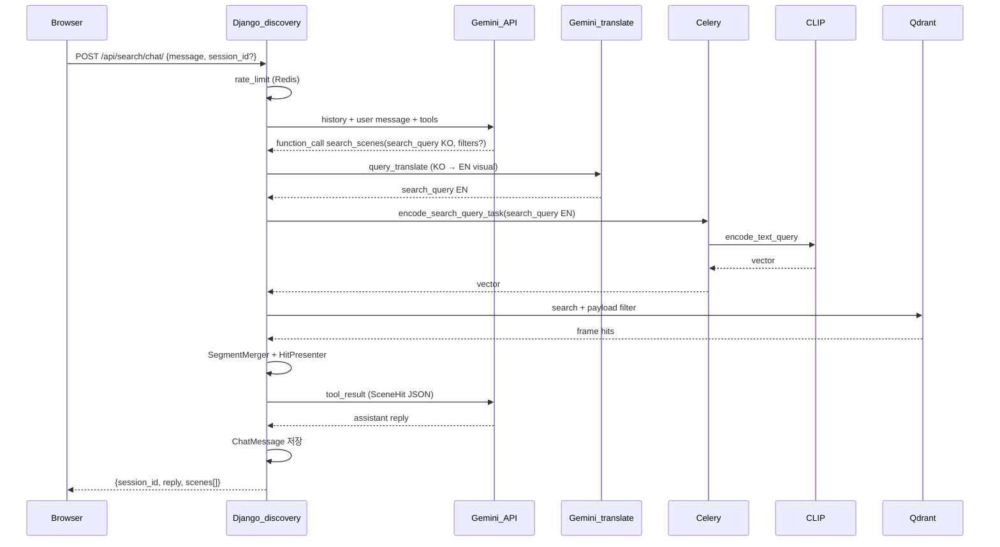

# Discovery (RAG 채팅 검색) 인수인계

공개 `/search/` 채팅 UX: **LLM(Gemini)** 이 대화·`search_query` 정리 → **Gemini(번역)** 으로 CLIP용 영어 시각 묘사 → **Celery** 에서 **CLIP** 텍스트 임베딩 → **Qdrant** 검색 → 구간 병합 → 카드(썸네일·영상·타임스탬프).

> **구현 상태**: `discovery` 앱 구현 완료 (2025-05). 아래 흐름·설정은 코드와 동기화되어 있습니다.

---

## 1. 프로세스 흐름

### 1.1 전체 (사용자 1턴)



### 1.2 인덱싱 (기존, 변경 없음)

업로드 → `EmbeddingJob` → Celery `run_embedding_job_task` → ffmpeg 프레임 → CLIP `encode_image` → Qdrant upsert (`timestamp_sec` in payload).

**프레임 시각(`timestamp_sec`)** — [`anime_indexing/video/frame_timestamps.py`](../anime_indexing/video/frame_timestamps.py), `.env`의 `VIDEO_EXTRACT_FPS`:

| `VIDEO_EXTRACT_FPS` | 계산 |
|---------------------|------|
| > 0 (기본 1) | `frame_index / VIDEO_EXTRACT_FPS` (초) |
| ≤ 0 (전 프레임) | `frames_pts_manifest.jsonl`의 ffprobe `pts_sec` **필수** — 없으면 잡 실패 + FFPROBE/FPS 설정 안내 |

기존에 색인된 벡터는 `index/24` 폴백일 수 있음 → **DONE 잡 재색인** 권장. trace stage `frame_times`에서 `source`, `sample_ts` 확인.

### 1.3 역할 분리 (핵심)

| 레이어 | 기술 | 입력 | 출력 |
|--------|------|------|------|
| 대화 | Gemini 2.5 Flash | 채팅 히스토리 | 자연어 + `search_scenes` tool call |
| EN 변환 | Gemini (전용 프롬프트) | tool `search_query` (한국어) | CLIP용 영어 시각 묘사 |
| 검색 | CLIP + Qdrant | **번역된 `search_query_en`** | 프레임 hit |
| 후처리 | Django | hits | `SceneSegment` 3~8개 |
| 표현 | Django presenter | segments | `thumbnail_url`, `video_url`, `peak_sec` |

**안티패턴**: 사용자 원문 전체를 CLIP에 직접 전달, LLM이 타임스탬프를 추측.

---

## 2. 확정 설계 결정

| 항목 | 값 |
|------|-----|
| LLM | Google **Gemini 2.5 Flash** (무료 티어) |
| CLIP 검색 | **Celery 동기** (`encode_search_query_task`, worker concurrency=1) |
| 미디어 | **DONE 잡 스테이징 유지** (media 승격 없음) |
| 검색 hit 미디어 | Qdrant payload의 `job_public_id` → DONE 잡의 스테이징 파일 |
| DB (MVP) | SQLite → 공개 전 Postgres |
| 첫 화면 | `/search/` 채팅 + 결과 카드 (`chat_first`) |

---

## 3. 디렉터리·파일 (구현 시 생성)

```
discovery/
  apps.py
  models.py              # ChatSession, ChatMessage
  admin.py
  urls.py
  views.py               # search_page, chat_api, thumb, video
  tasks.py               # encode_search_query_task
  services/
    segment_merge.py     # merge_frame_hits → SceneSegment
    retrieval.py         # run_scene_search (translate + Celery + Qdrant)
    query_translate.py   # KO search_query → EN for CLIP
    presenter.py         # SceneHit DTO + URL
    rate_limit.py        # Redis IP limit
    chat_orchestrator.py # Gemini tool loop
    views_trace.py       # /search/traces/ UI
  (공통) anime_indexing/observability/pipeline_tracer.py
  templates/discovery/
    search_chat.html
    base_public.html
  static/discovery/
    search_chat.js
```

**수정 기존 파일**

- `anime_search/settings.py` — `INSTALLED_APPS`, Discovery 설정
- `anime_search/urls.py` — `include("discovery.urls")`
- `embeddings/models.py` — `source_video_filename`
- `embeddings/migrations/0002_...py`
- `catalog/views.py` — 업로드 시 `job.source_video_filename = dest_name`
- `embeddings/services/job_delete.py` — DONE 삭제 가드
- `requirements.txt` — `google-genai`, `redis` (이미 있음)
- `catalog/templates/catalog/base.html` — 글로벌 내비: 장면 채팅은 **「채팅」** 으로만 진입 (`/` 목록 → `/search/` 등)

---

## 4. 핵심 로직

### 4.1 `discovery/tasks.py` — CLIP 검색 벡터

```python
@shared_task(name="discovery.encode_search_query")
def encode_search_query_task(search_query: str) -> list[float]:
    from anime_indexing.frame_directory_embedding import get_vision_worker
    worker = get_vision_worker()
    vec = worker.encode_text_query(search_query)
    return vec.tolist()
```

웹 프로세스는 **CLIP을 로드하지 않음**. `apply_async(...).get(timeout=SEARCH_CELERY_TIMEOUT_SEC)`.

### 4.2 `discovery/services/retrieval.py`

```python
def run_scene_search(
    *,
    search_query: str,
    anime_slug: str | None = None,
    episode: int | None = None,
    genre_slugs: list[str] | None = None,
    limit: int = 50,
) -> tuple[list[SceneSegment], str]:
    clip_query = translate_search_query_for_clip(search_query)
    vec = _encode_via_celery(clip_query)
    hits = search_segments(
        query_vector=vec,
        limit=limit,
        anime_slug=anime_slug,
        episode=episode,
        genre_slugs=genre_slugs,
    )
    segments = merge_frame_hits(hits, gap_sec=1.5, max_segments=8)
    return segments, clip_query
```

재사용: [`anime_indexing/vectors/qdrant_search.py`](../anime_indexing/vectors/qdrant_search.py) `search_segments`.  
번역: [`discovery/services/query_translate.py`](../discovery/services/query_translate.py) — `SEARCH_QUERY_TRANSLATE_ENABLED=false` 시 원문 그대로 CLIP.

### 4.2.1 `discovery/services/query_translate.py`

- Gemini 단일 turn, tool 없음, temperature 낮음
- 이미 영어 위주(ASCII ≥ 85%)면 API 호출 생략
- 실패 시 원문 fallback + warning log

### 4.3 `discovery/services/segment_merge.py`

- hit을 `(anime_id, episode, job_public_id)` + `timestamp_sec` 순 정렬
- 인접 프레임 간격 > **1.5초** 이면 새 구간
- 구간별 **최고 score** 프레임 = 대표 썸네일·`peak_sec`
- score 내림차순 상위 **12**개 후보만 병합 (`SEARCH_MERGE_MAX_SEGMENTS`)
- `SEARCH_MIN_SCORE` 미만 탈락, 상위 **12**개만 UI (`SEARCH_MAX_SCENES`)

### 4.4 `discovery/services/presenter.py`

입력: `SceneSegment`, `HttpRequest`  
출력 dict 예:

```python
{
  "anime_title": "원피스",
  "episode": 3,
  "episode_title": "…",
  "display_label": "(원피스) 3화 … 6:55",
  "peak_sec": 415.2,
  "time_label": "6:55",
  "score": 0.82,
  "similarity_label": "82%(score: 0.82)",
  "frame_file": "frame_001234.jpg",
  "job_public_id": "uuid",
  "thumbnail_url": "/api/search/thumb/<job>/<frame>.jpg",
  "video_url": "/api/search/video/<job>/<file>.mp4",
  "video_start_sec": 415.2,
}
```

- `EmbeddingJob` 로드: `public_id=segment.job_public_id`, `status=DONE`
- `video` 파일명: `job.source_video_filename` 없으면 `find_first_video(input_dir)`
- URL: `reverse("discovery_thumb")`, `reverse("discovery_video")`

### 4.5 `discovery/services/chat_orchestrator.py` — Gemini tool loop

**도구 `search_scenes`**

| 파라미터 | 타입 | 설명 |
|----------|------|------|
| `search_query` | string | 시각 검색용 1~2문장, **한국어** (필수) |
| `anime_id` | string? | 슬러그 필터 |
| `episode` | int? | 화수 |
| `genre_slugs` | string[]? | 장르 |

흐름 (최대 3 라운드):

1. DB의 **USER/ASSISTANT만** 최근 `CHAT_MAX_HISTORY`건으로 프롬프트 조립(현재 메시지는 1회만; TOOL은 슬롯·문자열 모두 제외)
2. Gemini 호출 → `function_call` → `run_scene_search` → `present_scenes` (동일 턴 다중 `search_scenes`는 `_merge_scene_lists`로 UI `scenes` 병합)
3. tool result를 Gemini에 전달 → 최종 assistant 텍스트
4. 성공 시 `transaction.atomic`으로 user / tool / assistant 일괄 저장 (`tool_payload`에 `scenes`, `search_query_ko`, `search_query_en` 보관). Gemini·검색 실패 시 메시지 미저장

**세션**: `session_id`가 UUID 형식이지만 DB에 없으면 HTTP **404** (`session not found`). 클라이언트는 `sessionStorage` 초기화 후 재전송 시 새 세션.

**시스템 프롬프트 요지**

- 한국어로 친절히 안내
- 검색 시 잡담 제거한 **한국어** `search_query` 작성 (EN 변환은 서버)
- 도구 JSON에 없는 시간·URL invent 금지

### 4.6 미디어 뷰

- `GET /api/search/thumb/<uuid:job_id>/<path:frame_file>` — `staging/.../frames/` JPG, `DONE`만
- `GET /api/search/video/<uuid:job_id>/<str:filename>` — `input/` 동영상, `Range` 지원 (`FileResponse`)
- path traversal: `Path.name` + 기존 `_safe_video_name` 패턴

### 4.7 DONE 잡 삭제 가드

[`embeddings/services/job_delete.py`](../embeddings/services/job_delete.py):

```python
if job.status == EmbeddingJob.Status.DONE and settings.DISCOVERY_PROTECT_DONE_JOBS:
    raise JobDeleteError("완료(DONE) 잡은 공개 검색 미디어용으로 삭제할 수 없습니다.", status_code=409)
```

### 4.8 Rate limit

- Redis key: `discovery:rl:{ip}` — 분당 `SEARCH_RATE_LIMIT_PER_MIN` (기본 20)
- 초과 시 HTTP 429

---

## 5. API·URL

| Method | Path | 설명 |
|--------|------|------|
| GET | `/` | **채팅 목록** (최근 `ChatSession`, 서버 DB) |
| GET | `/search/` | 새 장면 검색 채팅 |
| GET | `/search/<session_uuid>/` | 기존 세션 이어하기 (메시지·마지막 scenes 복원) |
| GET | `/api/search/sessions/` | 세션 목록 JSON |
| GET | `/api/search/sessions/<uuid>/messages/` | 세션 메시지 + `last_scenes` JSON |
| GET | `/search/traces/` | 파이프라인 trace 목록 (staff / `DEBUG`) |
| GET | `/search/traces/<uuid>/` | trace 단계별 상세 (staff / `DEBUG`) |
| POST | `/api/search/chat/` | `{ "message": "...", "session_id": "uuid?" }` → `{ session_id, reply, scenes }` |
| GET | `/api/search/thumb/...` | 썸네일 |
| GET | `/api/search/video/...` | 영상 스트리밍 |

장면 검색은 Discovery 채팅 API **`POST /api/search/chat/`** 만 사용. (구 `POST /api/embed/search/` 제거)

### POST `/api/search/chat/` 응답 예

```json
{
  "session_id": "550e8400-e29b-41d4-a716-446655440000",
  "reply": "3화 6분 55초 근처 후보를 찾았어요.",
  "scenes": [ { "anime_id": "...", "thumbnail_url": "...", "video_url": "...", "peak_sec": 415.2 } ]
}
```

---

## 6. 설정값 (환경변수)

로컬에서는 프로젝트 루트 [`.env`](../.env) (템플릿: [`.env.example`](../.env.example))에 두고, [`anime_search/settings.py`](../anime_search/settings.py)가 시작 시 `load_dotenv`로 읽습니다.

| 변수 | 기본값 | 설명 |
|------|--------|------|
| `GEMINI_API_KEY` | (없음) | **필수** (채팅). [Google AI Studio](https://aistudio.google.com/apikey) |
| `GEMINI_MODEL` | `gemini-2.5-flash` | LLM 모델 id (`2.0-flash`는 신규 키 미지원) |
| `SEARCH_CELERY_TIMEOUT_SEC` | `120` | 검색용 Celery `get()` 타임아웃 |
| `SEARCH_RATE_LIMIT_PER_MIN` | `20` | IP당 분당 채팅 요청 |
| `CHAT_MAX_HISTORY` | `20` | 세션에 Gemini에 넘길 최대 메시지 수 |
| `SEARCH_QUERY_TRANSLATE_ENABLED` | `true` | CLIP 직전 Gemini EN 변환 on/off |
| `DISCOVERY_PROTECT_DONE_JOBS` | `true` | DONE 잡 삭제 차단 |
| `SEGMENT_MERGE_GAP_SEC` | `1.5` | 구간 병합 간격(초) |
| `SEARCH_MIN_SCORE` | `0.24` | 이 점수 미만 장면 탈락 (cosine) |
| `SEARCH_MAX_SCENES` | `12` | UI에 표시할 최대 장면 수 |
| `SEARCH_MERGE_MAX_SEGMENTS` | `12` | 병합 후보 상한 (필터 전) |
| `QDRANT_URL` | — | 없으면 검색 hit 0 (§7.3) |
| `QDRANT_API_KEY` | — | 클라우드 Qdrant |
| `QDRANT_COLLECTION` | `anime_clip` | 컬렉션명 |
| `CELERY_BROKER_URL` | `redis://127.0.0.1:6379/0` | Celery + rate limit (§7.2) |
| `CELERY_TASK_ALWAYS_EAGER` | — | `true`면 Celery 없이 동기(로컬 단독 테스트) |
| `CELERY_WORKER_CONCURRENCY` | `1` | CLIP+MPS 안정성 |
| `ANIME_DATA_ROOT` | `<project>/data` | 스테이징 미디어 |
| `CLIP_MODEL_NAME` | `ViT-L/14` | 인덱싱·검색 공통 |
| `PIPELINE_TRACE_ENABLED` | `true` | 검색·색인 trace DB/로그 기록 on/off |
| `PIPELINE_TRACE_LOG_TOP_HITS` | `10` | trace payload에 넣을 Qdrant 상위 hit 수 |

`settings.py` 추가 예:

```python
INSTALLED_APPS += ["discovery"]

GEMINI_API_KEY = os.environ.get("GEMINI_API_KEY", "").strip()
GEMINI_MODEL = os.environ.get("GEMINI_MODEL", "gemini-2.5-flash").strip()
SEARCH_CELERY_TIMEOUT_SEC = int(os.environ.get("SEARCH_CELERY_TIMEOUT_SEC", "120"))
SEARCH_RATE_LIMIT_PER_MIN = int(os.environ.get("SEARCH_RATE_LIMIT_PER_MIN", "20"))
CHAT_MAX_HISTORY = int(os.environ.get("CHAT_MAX_HISTORY", "20"))
SEARCH_QUERY_TRANSLATE_ENABLED = os.environ.get("SEARCH_QUERY_TRANSLATE_ENABLED", "true").lower() in ("1", "true", "yes")
DISCOVERY_PROTECT_DONE_JOBS = os.environ.get("DISCOVERY_PROTECT_DONE_JOBS", "true").lower() in ("1", "true", "yes")
SEGMENT_MERGE_GAP_SEC = float(os.environ.get("SEGMENT_MERGE_GAP_SEC", "1.5"))
```

---

## 7. Redis·Qdrant 초기화

Discovery·임베딩 파이프라인은 **Redis**(비동기 큐·레이트 리밋)와 **Qdrant**(CLIP 벡터 저장·검색)에 의존합니다. Django 마이그레이션과 별도로, 아래 인프라를 먼저 띄운 뒤 `.env`에 URL을 맞춥니다.

### 7.1 역할 요약

| 구성요소 | 용도 | 코드 위치 |
|----------|------|-----------|
| **Redis** | Celery broker·result backend (`CELERY_BROKER_URL`) | `anime_search/celery.py`, `embeddings/tasks.py`, `discovery/tasks.py` |
| **Redis** | 공개 채팅 IP 레이트 리밋 (`discovery:rl:{ip}`) | [`discovery/services/rate_limit.py`](../discovery/services/rate_limit.py) |
| **Qdrant** | 임베딩 upsert·검색·화별 삭제 | [`anime_indexing/vectors/qdrant_upsert.py`](../anime_indexing/vectors/qdrant_upsert.py), [`qdrant_search.py`](../anime_indexing/vectors/qdrant_search.py) |

레이트 리밋은 `CELERY_BROKER_URL`이 `redis://`로 시작할 때만 동작합니다. 그 외 URL이면 **조용히 스킵**됩니다(채팅은 가능, 제한 없음).

### 7.2 Redis — 설치·기동

**로컬(macOS 예)**

```bash
brew install redis
brew services start redis   # 또는 포그라운드: redis-server
```

**연결 확인**

```bash
redis-cli ping   # PONG
```

**`.env` (기본값 그대로면 생략 가능)**

```bash
CELERY_BROKER_URL=redis://127.0.0.1:6379/0
# CELERY_RESULT_BACKEND=   # 비우면 broker와 동일 DB
```

**초기화·스키마**

- 별도 마이그레이션 없음. Celery가 태스크 메타를 키로 쓰고, Discovery는 `INCR` + `EXPIRE 60`으로 분당 카운터만 씁니다.
- **DB 번호**: 기본 `6379/0`. broker와 rate limit이 **같은 Redis 인스턴스·DB**를 공유합니다.

**초기화(리셋) — 큐·레이트 리밋 비우기**

```bash
# 해당 DB만 비움 (다른 앱이 같은 DB를 쓰면 주의)
redis-cli -n 0 FLUSHDB
```

- Celery worker·runserver **재시작** 권장.
- in-flight 임베딩·YouTube import 태스크는 사라집니다. `EmbeddingJob` 행은 SQLite/Postgres에 남으므로, 필요 시 잡 목록에서 **재실행**하세요.

**장애 징후**

| 증상 | 원인 |
|------|------|
| 업로드 후 잡이 `pending`에서 안 움직임 | worker 미기동 또는 Redis 다운 |
| 채팅 503 / CLIP 타임아웃 | worker 없음(큐 적재만 됨) |
| 레이트 리밋이 안 걸림 | broker가 `redis://`가 아님 |

### 7.3 Qdrant — 설치·기동

**로컬(Docker 예, 데이터는 프로젝트 밖에 두어도 됨)**

```bash
docker run -d --name qdrant \
  -p 6333:6333 -p 6334:6334 \
  -v "$(pwd)/data/qdrant_storage:/qdrant/storage" \
  qdrant/qdrant
```

- REST·gRPC: `http://127.0.0.1:6333` (대시보드: 동일 호스트 `:6333/dashboard` 버전에 따라 제공)
- 클라우드 Qdrant 사용 시: 콘솔 URL + `QDRANT_API_KEY`

**`.env`**

```bash
QDRANT_URL=http://127.0.0.1:6333
# QDRANT_API_KEY=          # 클라우드·인증 필요 시
# QDRANT_COLLECTION=anime_clip
```

**연결 확인 (선택)**

- 컨테이너: `docker ps` / `docker logs qdrant`
- 웹 UI: 브라우저에서 `http://127.0.0.1:6333/dashboard` (Qdrant 버전에 따라 경로 상이)
- 앱과 동일 설정으로 확인하려면 §7.4의 `manage.py shell` 예시 사용

**컬렉션·인덱스 — 자동 생성(curl·수동 스키마 없음)**

- 첫 **임베딩 upsert** 시 [`ensure_collection_and_indexes`](../anime_indexing/vectors/qdrant_upsert.py)가 멱등으로 실행됩니다.
  - 컬렉션 이름: `QDRANT_COLLECTION` (기본 `anime_clip`)
  - 거리: **cosine**
  - 벡터 차원: 해당 배치 CLIP 출력 차원 (ViT-L/14 기준 **768**)
  - payload 인덱스: `job_public_id`, `anime_id`, `episode`, `episode_id`, `genre`, `frame_index`, `frame_file`
- 포인트 ID: `uuid5` 고정 네임스페이스 + `{job_public_id}:{frame_index}` ([`anime_indexing/constants.py`](../anime_indexing/constants.py))

**`QDRANT_URL`이 비어 있으면**

- `qdrant_is_configured()` → `False`
- worker는 임베딩은 **DONE**까지 가지만 Qdrant 적재 **스킵** (trace에 `qdrant_configured=false`)
- `/search/` 검색 hit **0건**

**중요: runserver와 Celery worker 모두 같은 `.env`**

- worker만 `QDRANT_URL`이 없으면 색인만 실패하고, runserver 검색은 빈 결과가 납니다.
- `.env` 수정 후 **runserver·worker 재시작**.

### 7.4 Qdrant 초기화(리셋)

**서버 기동 ≠ 컬렉션 생성.** Docker로 Qdrant만 띄우면 DB는 비어 있습니다. 컬렉션·payload 인덱스는 **첫 임베딩 upsert** 때 코드가 만듭니다. HTTP `curl`로 스키마를 넣는 방식은 이 프로젝트에서 쓰지 않습니다(컬렉션 생성·인덱스는 [`ensure_collection_and_indexes`](../anime_indexing/vectors/qdrant_upsert.py)가 담당).

**A. 로컬 전체 초기화** (벡터·컬렉션·디스크)

```bash
docker rm -f qdrant
rm -rf data/qdrant_storage   # §7.3에서 마운트한 경로
# 이후 docker run ... (§7.3) 다시 실행
```

**B. 컬렉션만 비우기**

- UI: [대시보드](http://127.0.0.1:6333/dashboard)에서 `anime_clip`(또는 `QDRANT_COLLECTION` 값) 삭제
- CLI: 아래 `manage.py shell` — `.env`의 `QDRANT_URL`·`QDRANT_API_KEY`가 그대로 적용됨

삭제 후 다음 upsert 시 §7.3과 같이 컬렉션이 자동 재생성됩니다.

**C. 일부 벡터만**

| 상황 | 방법 |
|------|------|
| 특정 잡 | 잡 삭제 → [`embeddings/services/job_delete.py`](../embeddings/services/job_delete.py)의 `delete_points_for_job_public_id` |
| 동일 화 재업로드 | 임베딩 워크플로의 [`delete_points_for_anime_episode`](../anime_indexing/vectors/qdrant_upsert.py) 후 upsert |

**컬렉션 삭제 — Django shell**

```bash
# 프로젝트 루트, .env 로드된 상태
python manage.py shell
```

```python
from django.conf import settings
from qdrant_client import QdrantClient

client = QdrantClient(
    url=settings.QDRANT_URL,
    api_key=settings.QDRANT_API_KEY or None,
)
col = settings.QDRANT_COLLECTION
print("exists:", client.collection_exists(col))
if client.collection_exists(col):
    client.delete_collection(col)
    print("deleted:", col)
# 이후 EmbeddingJob 재실행 또는 업로드 → upsert 시 컬렉션·인덱스 자동 생성
```

리셋 후에는 **DONE 잡을 다시 돌리거나** 업로드·재enqueue로 벡터를 채워야 `/search/`에 결과가 나옵니다. 스테이징 JPG·동영상은 Qdrant와 별개(`ANIME_DATA_ROOT/staging/`)이므로, 디스크만 남고 벡터만 비운 상태가 될 수 있습니다.

### 7.5 로컬 일괄 기동 순서

1. Redis (`redis-server` 또는 `brew services start redis`)
2. Qdrant (Docker 등, `QDRANT_URL` 확인)
3. `.env`에 `QDRANT_URL`, `GEMINI_API_KEY`, `CELERY_BROKER_URL`
4. `python manage.py migrate`
5. `celery -A anime_search worker -l info`
6. `python manage.py runserver`
7. 업로드 1건 → 잡 `DONE` + trace `qdrant_configured=true`, `points_upserted>0` 확인 후 `/search/` 테스트

---

## 8. 로컬 실행

Redis·Qdrant 설치·리셋·환경변수는 **§7** 참고.

```bash
cp .env.example .env
# .env 에 GEMINI_API_KEY, QDRANT_URL 등 설정 (전체 키: 프로젝트 루트 .env.example)

# 터미널 1
redis-server

# 터미널 2 — 반드시 필요 (CLIP 검색)
celery -A anime_search worker -l info

# 터미널 3
python manage.py migrate
python manage.py runserver
```

`.env` 수정 후에는 **runserver·Celery worker를 재시작**해야 반영됩니다. 로컬 설정은 `export` 대신 `.env`만 쓰는 것을 권장합니다.

- 공개 검색: http://localhost:8000/search/
- trace 뷰어: http://localhost:8000/search/traces/ (staff 또는 `DEBUG=True`)
- 운영 업로드: http://localhost:8000/upload/

**전제**: 최소 1개 `EmbeddingJob`이 `DONE`이고 Qdrant에 벡터가 있어야 검색 결과가 나옵니다.

---

## 9. 파이프라인 Trace (검색·색인 디버깅)

검색 1회(`search_scenes`) 또는 임베딩 잡 1회마다 `PipelineTrace` 행 + 터미널 JSON 로그 1줄(`anime_search.pipeline`)이 남습니다.

### 9.1 확인 절차

1. `/search/`에서 문제 쿼리 1회 전송
2. http://localhost:8000/search/traces/ → 최신 `search` / `empty` / `error` 행 → **상세**
3. `stages` 순서로 어디서 0건이 됐는지 확인:

| stage | 의미 |
|-------|------|
| `gemini_no_tool` | LLM이 `search_scenes`를 호출하지 않음 |
| `input` / `translate` | 서버에 들어간 KO·EN 쿼리 |
| `clip_encode` | Celery/CLIP 텍스트 벡터 (실패 시 `pipeline_error`) |
| `qdrant_search` | `hit_count`, `configured`, `top_hits` |
| `merge` / `filter` | 구간 수, `below_min_score`·`max_scenes_cap` 탈락 |
| `present` | DONE 잡·동영상 없어 카드 실패 (`dropped`) |

색인 문제면 같은 목록에서 `kind=indexing` 필터 → `indexing_done.qdrant_configured`, `points_upserted` 확인 (배치마다 stage 없음, 잡당 요약 1건).

### 9.2 기타

- Django Admin → `PipelineTrace` (payload readonly)
- `ChatMessage.tool_payload.trace_id` → 상세 URL과 동일 UUID
- `PIPELINE_TRACE_ENABLED=false`면 기록 생략 (기능만 끔)

---

## 10. 장애·엣지 케이스

| 상황 | 동작 |
|------|------|
| `GEMINI_API_KEY` 없음 | 503 + "채팅 설정이 완료되지 않았습니다" |
| Redis 다운 | Celery 큐 불가, 잡 정체; rate limit은 스킵(§7.2) |
| Celery/worker 다운 | 503 + CLIP 타임아웃 메시지 |
| Qdrant 없음 / worker에 `QDRANT_URL` 없음 | 빈 `scenes`, 색인 `qdrant_configured=false` (§7.3) |
| 스테이징 삭제됨 | thumb/video 404 — DONE 잡 삭제 가드로 예방 |
| 동일 화 재업로드 | Qdrant에 옛·새 벡터 공존 가능 → 카드 URL은 각 hit의 `job_public_id` 기준 |

---

## 11. 구현 체크리스트 (Agent 모드)

- [x] `discovery` 앱 + migrate `ChatSession` / `ChatMessage`
- [x] `EmbeddingJob.source_video_filename` migrate
- [x] `encode_search_query_task` + `retrieval` + `segment_merge` + `presenter`
- [x] Gemini `chat_orchestrator` + `POST /api/search/chat/`
- [x] `/search/` UI + CSRF fetch
- [x] thumb/video + rate limit + DONE delete guard
- [x] `docs/HANDOVER_DISCOVERY.md` ↔ 코드 동기화

---

## 12. 관련 기존 코드

| 파일 | 역할 |
|------|------|
| [`anime_indexing/vectors/qdrant_client.py`](../anime_indexing/vectors/qdrant_client.py) | Qdrant 클라이언트·설정 공통 |
| [`anime_indexing/vectors/qdrant_search.py`](../anime_indexing/vectors/qdrant_search.py) | Qdrant search |
| [`anime_indexing/clip/vision.py`](../anime_indexing/clip/vision.py) `encode_text_query` | 검색 벡터 |
| [`embeddings/tasks.py`](../embeddings/tasks.py) | 인덱싱 Celery |
| [`catalog/views.py`](../catalog/views.py) `serve_uploaded_video` | staff 미리보기 (공개는 discovery 라우트) |

---

*문서 버전: 설계 확정 기준. 코드 생성 후 이 섹션에 “구현 완료 일자”를 갱신하세요.*
