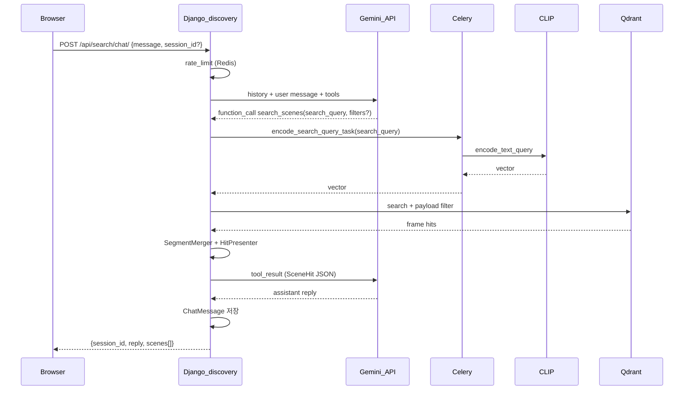

# Discovery (RAG 채팅 검색) 인수인계

공개 `/search/` 채팅 UX: **LLM(Gemini)** 이 대화·`search_query` 정리 → **Celery** 에서 **CLIP** 텍스트 임베딩 → **Qdrant** 검색 → 구간 병합 → 카드(썸네일·영상·타임스탬프).

> **구현 상태**: `discovery` 앱 구현 완료 (2025-05). 아래 흐름·설정은 코드와 동기화되어 있습니다.

---

## 1. 프로세스 흐름

### 1.1 전체 (사용자 1턴)



### 1.2 인덱싱 (기존, 변경 없음)

업로드 → `EmbeddingJob` → Celery `run_embedding_job_task` → ffmpeg 프레임 → CLIP `encode_image` → Qdrant upsert (`timestamp_sec` in payload).

### 1.3 역할 분리 (핵심)

| 레이어 | 기술 | 입력 | 출력 |
|--------|------|------|------|
| 대화 | Gemini 2.5 Flash | 채팅 히스토리 | 자연어 + `search_scenes` tool call |
| 검색 | CLIP + Qdrant | LLM이 만든 **`search_query`만** | 프레임 hit |
| 후처리 | Django | hits | `SceneSegment` 3~8개 |
| 표현 | Django presenter | segments | `thumbnail_url`, `video_url`, `peak_sec` |

**안티패턴**: 사용자 원문 전체를 CLIP에 직접 전달, LLM이 타임스탬프를 추측.

---

## 2. 확정 설계 결정

| 항목 | 값 |
|------|-----|
| LLM | Google **Gemini 2.5 Flash** (무료 티어) |
| CLIP 검색 | **Celery 동기** (`encode_search_query_task`, worker concurrency=1) |
| 미디어 | **DONE 잡 스테이징 유지** (media 승격 없음) |
| 검색 hit 미디어 | Qdrant payload의 `job_public_id` → DONE 잡의 스테이징 파일 |
| DB (MVP) | SQLite → 공개 전 Postgres |
| 첫 화면 | `/search/` 채팅 + 결과 카드 (`chat_first`) |

---

## 3. 디렉터리·파일 (구현 시 생성)

```
discovery/
  apps.py
  models.py              # ChatSession, ChatMessage
  admin.py
  urls.py
  views.py               # search_page, chat_api, thumb, video
  tasks.py               # encode_search_query_task
  services/
    segment_merge.py     # merge_frame_hits → SceneSegment
    retrieval.py         # run_scene_search (Celery + Qdrant)
    presenter.py         # SceneHit DTO + URL
    rate_limit.py        # Redis IP limit
    chat_orchestrator.py # Gemini tool loop
  templates/discovery/
    search_chat.html
    base_public.html
  static/discovery/
    search_chat.js
```

**수정 기존 파일**

- `anime_search/settings.py` — `INSTALLED_APPS`, Discovery 설정
- `anime_search/urls.py` — `include("discovery.urls")`
- `embeddings/models.py` — `source_video_filename`
- `embeddings/migrations/0002_...py`
- `catalog/views.py` — 업로드 시 `job.source_video_filename = dest_name`
- `embeddings/services/job_delete.py` — DONE 삭제 가드
- `requirements.txt` — `google-genai`, `redis` (이미 있음)
- `catalog/templates/catalog/base.html` — `/search/` 링크 (선택)

---

## 4. 핵심 로직

### 4.1 `discovery/tasks.py` — CLIP 검색 벡터

```python
@shared_task(name="discovery.encode_search_query")
def encode_search_query_task(search_query: str) -> list[float]:
    from anime_indexing.frame_directory_embedding import get_vision_worker
    worker = get_vision_worker()
    vec = worker.encode_text_query(search_query)
    return vec.tolist()
```

웹 프로세스는 **CLIP을 로드하지 않음**. `apply_async(...).get(timeout=SEARCH_CELERY_TIMEOUT_SEC)`.

### 4.2 `discovery/services/retrieval.py`

```python
def run_scene_search(
    *,
    search_query: str,
    anime_slug: str | None = None,
    episode: int | None = None,
    genre_slugs: list[str] | None = None,
    limit: int = 50,
) -> list[SceneSegment]:
    vec = _encode_via_celery(search_query)
    hits = search_segments(
        query_vector=vec,
        limit=limit,
        anime_slug=anime_slug,
        episode=episode,
        genre_slugs=genre_slugs,
    )
    return merge_frame_hits(hits, gap_sec=1.5, max_segments=8)
```

재사용: [`anime_indexing/vectors/qdrant_search.py`](../anime_indexing/vectors/qdrant_search.py) `search_segments`.

### 4.3 `discovery/services/segment_merge.py`

- hit을 `(anime_id, episode, job_public_id)` + `timestamp_sec` 순 정렬
- 인접 프레임 간격 > **1.5초** 이면 새 구간
- 구간별 **최고 score** 프레임 = 대표 썸네일·`peak_sec`
- score 내림차순 상위 **8**개

### 4.4 `discovery/services/presenter.py`

입력: `SceneSegment`, `HttpRequest`  
출력 dict 예:

```python
{
  "anime_id": "one_piece",
  "anime_title": "원피스",  # Anime.title or slug
  "episode": 3,
  "start_sec": 412.5,
  "end_sec": 418.0,
  "peak_sec": 415.2,
  "score": 0.82,
  "frame_file": "frame_001234.jpg",
  "job_public_id": "uuid",
  "thumbnail_url": "/api/search/thumb/<job>/<frame>.jpg",
  "video_url": "/api/search/video/<job>/<file>.mp4",
  "video_start_sec": 415.2,
}
```

- `EmbeddingJob` 로드: `public_id=segment.job_public_id`, `status=DONE`
- `video` 파일명: `job.source_video_filename` 없으면 `find_first_video(input_dir)`
- URL: `reverse("discovery_thumb")`, `reverse("discovery_video")`

### 4.5 `discovery/services/chat_orchestrator.py` — Gemini tool loop

**도구 `search_scenes`**

| 파라미터 | 타입 | 설명 |
|----------|------|------|
| `search_query` | string | 시각 검색용 1~2문장 (필수) |
| `anime_id` | string? | 슬러그 필터 |
| `episode` | int? | 화수 |
| `genre_slugs` | string[]? | 장르 |

흐름 (최대 3 라운드):

1. Gemini에 `ChatMessage` 히스토리 + user 입력
2. `function_call` → `run_scene_search` → `present_scenes`
3. tool result를 Gemini에 전달 → 최종 assistant 텍스트
4. DB에 user / tool / assistant 메시지 저장, `tool_payload`에 `scenes` 보관

**시스템 프롬프트 요지**

- 한국어로 친절히 안내
- 검색 시 잡담 제거한 `search_query` 작성
- 도구 JSON에 없는 시간·URL invent 금지

### 4.6 미디어 뷰

- `GET /api/search/thumb/<uuid:job_id>/<path:frame_file>` — `staging/.../frames/` JPG, `DONE`만
- `GET /api/search/video/<uuid:job_id>/<str:filename>` — `input/` 동영상, `Range` 지원 (`FileResponse`)
- path traversal: `Path.name` + 기존 `_safe_video_name` 패턴

### 4.7 DONE 잡 삭제 가드

[`embeddings/services/job_delete.py`](../embeddings/services/job_delete.py):

```python
if job.status == EmbeddingJob.Status.DONE and settings.DISCOVERY_PROTECT_DONE_JOBS:
    raise JobDeleteError("완료(DONE) 잡은 공개 검색 미디어용으로 삭제할 수 없습니다.", status_code=409)
```

### 4.8 Rate limit

- Redis key: `discovery:rl:{ip}` — 분당 `SEARCH_RATE_LIMIT_PER_MIN` (기본 20)
- 초과 시 HTTP 429

---

## 5. API·URL

| Method | Path | 설명 |
|--------|------|------|
| GET | `/search/` | 채팅 UI (공개) |
| POST | `/api/search/chat/` | `{ "message": "...", "session_id": "uuid?" }` → `{ session_id, reply, scenes }` |
| GET | `/api/search/thumb/...` | 썸네일 |
| GET | `/api/search/video/...` | 영상 스트리밍 |

내부 유지: `POST /api/embed/search/` (`X-Internal-Key` / DEBUG) — 브라우저에 키 노출 금지.

### POST `/api/search/chat/` 응답 예

```json
{
  "session_id": "550e8400-e29b-41d4-a716-446655440000",
  "reply": "3화 6분 55초 근처 후보를 찾았어요.",
  "scenes": [ { "anime_id": "...", "thumbnail_url": "...", "video_url": "...", "peak_sec": 415.2 } ]
}
```

---

## 6. 설정값 (환경변수)

로컬에서는 프로젝트 루트 [`.env`](../.env) (템플릿: [`.env.example`](../.env.example))에 두고, [`anime_search/settings.py`](../anime_search/settings.py)가 시작 시 `load_dotenv`로 읽습니다.

| 변수 | 기본값 | 설명 |
|------|--------|------|
| `GEMINI_API_KEY` | (없음) | **필수** (채팅). [Google AI Studio](https://aistudio.google.com/apikey) |
| `GEMINI_MODEL` | `gemini-2.5-flash` | LLM 모델 id (`2.0-flash`는 신규 키 미지원) |
| `SEARCH_CELERY_TIMEOUT_SEC` | `120` | 검색용 Celery `get()` 타임아웃 |
| `SEARCH_RATE_LIMIT_PER_MIN` | `20` | IP당 분당 채팅 요청 |
| `CHAT_MAX_HISTORY` | `20` | 세션에 Gemini에 넘길 최대 메시지 수 |
| `DISCOVERY_PROTECT_DONE_JOBS` | `true` | DONE 잡 삭제 차단 |
| `SEGMENT_MERGE_GAP_SEC` | `1.5` | 구간 병합 간격(초) |
| `QDRANT_URL` | — | 없으면 검색 hit 0 |
| `CELERY_BROKER_URL` | `redis://127.0.0.1:6379/0` | Celery + rate limit |
| `CELERY_TASK_ALWAYS_EAGER` | — | `true`면 Celery 없이 동기(로컬 단독 테스트) |
| `CELERY_WORKER_CONCURRENCY` | `1` | CLIP+MPS 안정성 |
| `ANIME_DATA_ROOT` | `<project>/data` | 스테이징 미디어 |
| `CLIP_MODEL_NAME` | `ViT-L/14` | 인덱싱·검색 공통 |

`settings.py` 추가 예:

```python
INSTALLED_APPS += ["discovery"]

GEMINI_API_KEY = os.environ.get("GEMINI_API_KEY", "").strip()
GEMINI_MODEL = os.environ.get("GEMINI_MODEL", "gemini-2.5-flash").strip()
SEARCH_CELERY_TIMEOUT_SEC = int(os.environ.get("SEARCH_CELERY_TIMEOUT_SEC", "120"))
SEARCH_RATE_LIMIT_PER_MIN = int(os.environ.get("SEARCH_RATE_LIMIT_PER_MIN", "20"))
CHAT_MAX_HISTORY = int(os.environ.get("CHAT_MAX_HISTORY", "20"))
DISCOVERY_PROTECT_DONE_JOBS = os.environ.get("DISCOVERY_PROTECT_DONE_JOBS", "true").lower() in ("1", "true", "yes")
SEGMENT_MERGE_GAP_SEC = float(os.environ.get("SEGMENT_MERGE_GAP_SEC", "1.5"))
```

---

## 7. 로컬 실행

```bash
cp .env.example .env
# .env 에 GEMINI_API_KEY, QDRANT_URL 등 설정 (전체 키: 프로젝트 루트 .env.example)

# 터미널 1
redis-server

# 터미널 2 — 반드시 필요 (CLIP 검색)
celery -A anime_search worker -l info

# 터미널 3
python manage.py migrate
python manage.py runserver
```

`.env` 수정 후에는 **runserver·Celery worker를 재시작**해야 반영됩니다. 로컬 설정은 `export` 대신 `.env`만 쓰는 것을 권장합니다.

- 공개 검색: http://localhost:8000/search/
- 운영 업로드: http://localhost:8000/upload/

**전제**: 최소 1개 `EmbeddingJob`이 `DONE`이고 Qdrant에 벡터가 있어야 검색 결과가 나옵니다.

---

## 8. 장애·엣지 케이스

| 상황 | 동작 |
|------|------|
| `GEMINI_API_KEY` 없음 | 503 + "채팅 설정이 완료되지 않았습니다" |
| Celery/worker 다운 | 503 + CLIP 타임아웃 메시지 |
| Qdrant 없음 | 빈 `scenes`, LLM이 "인덱스된 작품이 없다" 안내 |
| 스테이징 삭제됨 | thumb/video 404 — DONE 잡 삭제 가드로 예방 |
| 동일 화 재업로드 | Qdrant에 옛·새 벡터 공존 가능 → 카드 URL은 각 hit의 `job_public_id` 기준 |

---

## 9. 구현 체크리스트 (Agent 모드)

- [x] `discovery` 앱 + migrate `ChatSession` / `ChatMessage`
- [x] `EmbeddingJob.source_video_filename` migrate
- [x] `encode_search_query_task` + `retrieval` + `segment_merge` + `presenter`
- [x] Gemini `chat_orchestrator` + `POST /api/search/chat/`
- [x] `/search/` UI + CSRF fetch
- [x] thumb/video + rate limit + DONE delete guard
- [x] `docs/HANDOVER_DISCOVERY.md` ↔ 코드 동기화

---

## 10. 관련 기존 코드

| 파일 | 역할 |
|------|------|
| [`embeddings/views.py`](../embeddings/views.py) `search_segments_api` | 내부용 검색 (웹에서 CLIP 직접 — **공개 경로에서는 사용하지 말 것**) |
| [`anime_indexing/vectors/qdrant_search.py`](../anime_indexing/vectors/qdrant_search.py) | Qdrant search |
| [`anime_indexing/clip/vision.py`](../anime_indexing/clip/vision.py) `encode_text_query` | 검색 벡터 |
| [`embeddings/tasks.py`](../embeddings/tasks.py) | 인덱싱 Celery |
| [`catalog/views.py`](../catalog/views.py) `serve_uploaded_video` | staff 미리보기 (공개는 discovery 라우트) |

---

*문서 버전: 설계 확정 기준. 코드 생성 후 이 섹션에 “구현 완료 일자”를 갱신하세요.*
